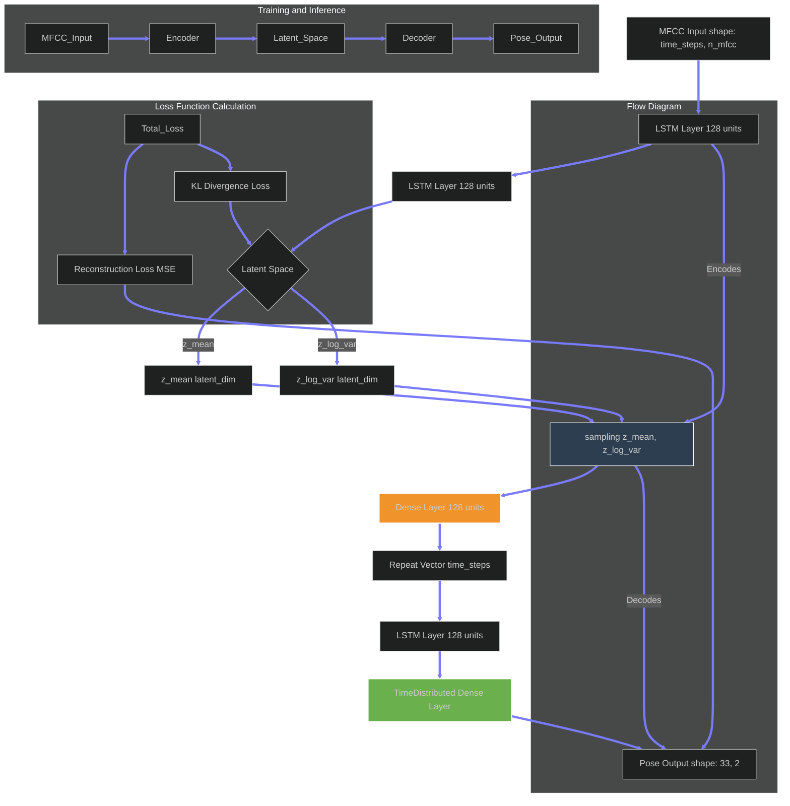

# The-Dancing-Project

## LSTM VAE

```mermaid
%%{init: {'theme': 'dark', 'themeVariables': { 'darkMode': true }}}%%
graph TD
    %% Block 1: Encoder
    A[MFCC Input shape: time_steps, n_mfcc] --> B[LSTM Layer 128 units]
    B --> C[LSTM Layer 128 units]
    C --> D{Latent Space}
    
    %% Latent Space: z_mean, z_log_var, sampling
    D -->|z_mean| E[z_mean latent_dim]
    D -->|z_log_var| F[z_log_var latent_dim]
    E --> G[sampling z_mean, z_log_var]
    F --> G
    
    %% Block 2: Decoder
    G --> H[Dense Layer 128 units]
    H --> I[Repeat Vector time_steps]
    I --> J[LSTM Layer 128 units]
    J --> K[TimeDistributed Dense Layer]
    K --> L[Pose Output shape: 33, 2]

    %% Input and Output shape description
    classDef input_output fill:#ffdd57,stroke:#333,stroke-width:4px;

    %% Flow diagram
    subgraph Flow Diagram
    B -->|Encodes| G -->|Decodes| L
    end

    %% Loss function calculation
    subgraph Loss Function Calculation
    Z[Reconstruction Loss MSE] --> L
    Y[KL Divergence Loss] --> D
    Total_Loss --> Z & Y
    end

    %% Training and Inference process
    subgraph Training and Inference
    MFCC_Input --> Encoder --> Latent_Space --> Decoder --> Pose_Output
    end

    %% Custom Colors for Nodes and Links
    classDef latent_space fill:#7ed6df,stroke:#fff,stroke-width:2px;
    classDef lstm_layer fill:#4834d4,stroke:#fff,stroke-width:2px;
    classDef dense_layer fill:#f0932b,stroke:#fff,stroke-width:2px;
    classDef time_distributed fill:#6ab04c,stroke:#fff,stroke-width:2px;
    classDef sampling fill:#2c3e50,stroke:#fff,stroke-width:2px;  %% Darker background for sampling block

    %% Apply Styles
    H:::dense_layer
    G:::sampling
    K:::time_distributed

    %% Customize Flow Line Width and Colors
    linkStyle default stroke:#7a7aff,stroke-width:4px
    linkStyle 0 stroke-width:4px
    linkStyle 1 stroke-width:4px
```
