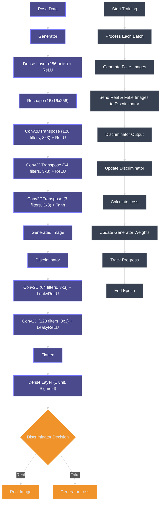

```mermaid
%%{init: {'theme': 'dark', 'themeVariables': { 'darkMode': true }}}%%
graph TD
    %% Block 1: Encoder
    A[MFCC Input shape: time_steps, n_mfcc] --> B[LSTM Layer 128 units]
    B --> C[LSTM Layer 128 units]
    C --> D{Latent Space}
    
    %% Latent Space: z_mean, z_log_var, sampling
    D -->|z_mean| E[z_mean latent_dim]
    D -->|z_log_var| F[z_log_var latent_dim]
    E --> G[sampling z_mean, z_log_var]
    F --> G
    
    %% Block 2: Decoder
    G --> H[Dense Layer 128 units]
    H --> I[Repeat Vector time_steps]
    I --> J[LSTM Layer 128 units]
    J --> K[TimeDistributed Dense Layer]
    K --> L[Pose Output shape: 33, 2]

    %% Input and Output shape description
    classDef input_output fill:#ffdd57,stroke:#333,stroke-width:4px;

    %% Flow diagram
    subgraph Flow Diagram
    B -->|Encodes| G -->|Decodes| L
    end

    %% Loss function calculation
    subgraph Loss Function Calculation
    Z[Reconstruction Loss MSE] --> L
    Y[KL Divergence Loss] --> D
    Total_Loss --> Z & Y
    end

    %% Training and Inference process
    subgraph Training and Inference
    MFCC_Input --> Encoder --> Latent_Space --> Decoder --> Pose_Output
    end

    %% Custom Colors for Nodes and Links
    classDef latent_space fill:#7ed6df,stroke:#fff,stroke-width:2px;
    classDef lstm_layer fill:#4834d4,stroke:#fff,stroke-width:2px;
    classDef dense_layer fill:#f0932b,stroke:#fff,stroke-width:2px;
    classDef time_distributed fill:#6ab04c,stroke:#fff,stroke-width:2px;
    classDef sampling fill:#2c3e50,stroke:#fff,stroke-width:2px;  %% Darker background for sampling block

    %% Apply Styles
    H:::dense_layer
    G:::sampling
    K:::time_distributed

    %% Customize Flow Line Width and Colors
    linkStyle default stroke:#7a7aff,stroke-width:4px
    linkStyle 0 stroke-width:4px
    linkStyle 1 stroke-width:4px
```

# The-Dancing-Project: Image Generation from Audio Features
       
<br>
 [](https://github.com/opencv) 
<br>
> [!IMPORTANT]
> **This project is currently under heavy development.**
<br>
This project uses two deep learning models to generate images from audio features by leveraging pose data as an intermediate step. It combines a **Variational Autoencoder (VAE)** with **Long Short-Term Memory (LSTM)** layers to learn the relationship between audio MFCC features and human pose landmarks, and a **Generative Adversarial Network (GAN)** to generate images from the pose data. This multi-modal architecture enables the generation of realistic human images based on the given audio input.

## 🏗️ Model Architecture

1. **Variational Autoencoder (VAE)** with **LSTM** layers:
    - Learns to encode audio MFCC features and decode them into pose landmarks.
    - Models the temporal dynamics of human motion based on the audio features.

2. **Generative Adversarial Network (GAN)**:
    - Takes pose landmarks as input and generates corresponding human images.
    - Includes a discriminator to distinguish between real and generated images.

## 🔑 Key Components

- **Audio MFCC Features**: Extracted from audio input and used as the initial data source for pose prediction.
- **Pose Landmarks**: Generated by the VAE-LSTM network, serving as the intermediate representation between audio features and image generation.
- **Generated Images**: Output of the GAN, aiming to create realistic human images based on predicted poses.

# 📑 Table of Contents

- [Dataset](#dataset)
- [LSTM-VAE Model Overview](#lstm-vae-model-overview)
    - [Generated Pose Data from the MFCC](#generated-pose-data-from-mfcc)
- [GAN Model Overview](#gan-model-overview)
    - [Generated Image from Pose Data](#generated-image-from-pose-data)
  
## 💾 Dataset

The dataset consists of:

- **MFCC Data**: Audio MFCC (Mel-frequency cepstral coefficients) features extracted from audio files.
- **Pose Data**: 33 pose landmarks per frame represented as (x, y) coordinates.
- **Image Data**: RGB images corresponding to the human pose landmarks.

### 📁 File Format

The data is stored in an HDF5 file. Each group contains:

- `audio_mfcc_sequences`: MFCC data (time-steps, n_mfcc).
- `pose_landmark_sequences`: Pose data (33 landmarks with 2D coordinates).
- `frames`: RGB images corresponding to the pose.

### Example HDF5 File Structure

```plaintext
Dataset1/
    ├── audio_mfcc_sequences: (149, 13)
    ├── pose_landmark_sequences: (33, 2)
    ├── frames: (640, 360, 3)
Dataset2/
    .
    .
    .
```

## 🤖 LSTM-VAE Model Overview

The **LSTM Variational Autoencoder (VAE)** learns a latent space representation that maps MFCC features to pose landmarks. The model consists of:

1. **Encoder**: An LSTM-based encoder that reduces MFCC features to a latent space.
2. **Decoder**: A corresponding LSTM-based decoder that generates pose landmarks from the latent space.
3. **Loss Function**: Combines reconstruction loss and KL divergence to optimize the VAE.



### 🎶🕺 Generated Pose Data from MFCC
Here is an example of generated pose data from the MFCC features using the model:


## 🎨 GAN Model Overview

This project utilizes a Generative Adversarial Network (GAN) to generate human images from pose data. The GAN consists of a **Generator** and a **Discriminator** network, where the generator learns to map pose landmarks to corresponding images, and the discriminator differentiates between real and generated images. Below is an overview of the model's architecture and improvements.

### Generator Architecture

The generator takes **pose data** (33 landmarks with (x, y) coordinates) as input and produces an image that corresponds to the human pose. The architecture consists of dense layers, activation functions, and batch normalization for stable learning. Here's the flow of the generator:

### Discriminator

The discriminator network takes both real and generated images as input and classifies them as either real or fake. It is trained alongside the generator in a competitive process. By learning to distinguish between real and generated images, the discriminator helps to improve the quality of the images produced by the generator.

### Loss Functions

- **Adversarial Loss**: This loss is used to train the generator to produce images that are indistinguishable from real images. The goal of the adversarial loss is to fool the discriminator into classifying the generated images as real.

- **Perceptual Loss**: Perceptual loss helps to improve the realism of the generated images by focusing on high-level features from pre-trained models. Instead of simply minimizing pixel differences, this loss ensures that the generated images are perceptually similar to real images by focusing on important structural elements.



### 🕺💃 Generated Image from Pose Data

The following image is generated by the model using pose data as input. The current model can generate images based on the pose, but the output quality can be further improved with more data and architectural updates.


### 📈 Improvements Needed:
- **Training with More Data**: To enhance the accuracy and realism of the generated images, the model needs to be trained on a larger and more diverse dataset.
- **Model Architecture Updates**: Updates to the architecture, such as using attention mechanisms, residual blocks, or progressive growing, can significantly enhance the quality of the generated images.

